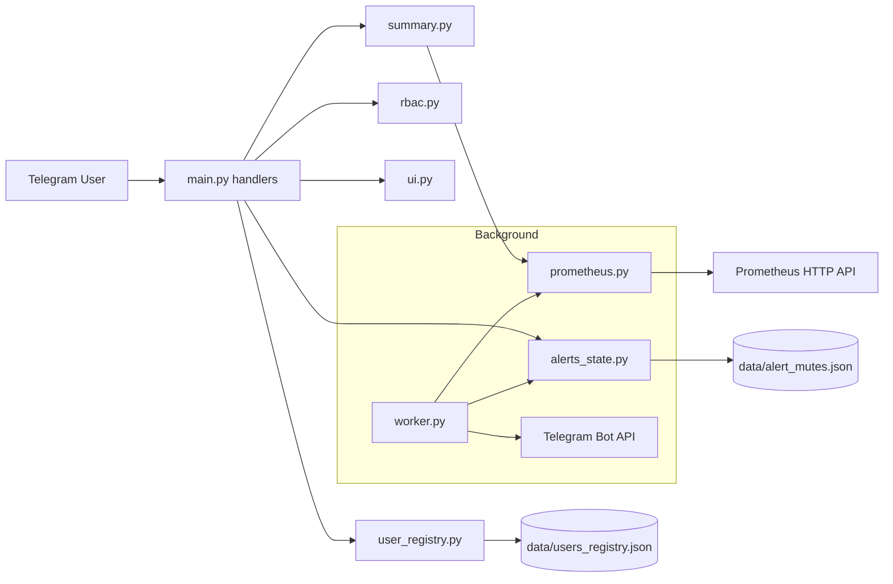

# Grafana Telegram Bot — полная техническая документация

> Подробная developer-level документация по архитектуре, логике, функциям, состояниям и эксплуатации бота из папки `Боты ТГ/grafana_bot`.

---

## 1) Назначение проекта

`grafana_bot` — Telegram-бот для оперативного мониторинга серверов (нод), который:

- получает метрики из Prometheus;
- показывает состояние нод (онлайн/оффлайн);
- показывает сводку по загрузке CPU/RAM/Disk и трафику;
- умеет детально показывать метрики по конкретной ноде;
- отправляет фоновые алерты при падении ноды и при переполнении диска;
- поддерживает персональное отключение алертов (mute) для каждого пользователя;
- ведёт реестр гостей и поддерживает блокировку пользователей админом.

---

## 2) Структура каталогов

```text
grafana_bot/
├─ bot/
│  ├─ main.py            # Точка входа Telegram-бота, маршрутизация команд/кнопок
│  ├─ ui.py              # Генерация inline/reply клавиатур
│  ├─ prometheus.py      # Работа с Prometheus API, PromQL-запросы, кэш
│  ├─ summary.py         # Формирование текстов статуса/сводки
│  ├─ worker.py          # Фоновый цикл алертов
│  ├─ reserve_logic.py   # Определение статуса ноды (онлайн/оффлайн)
│  ├─ rbac.py            # Проверка прав и доступов
│  ├─ user_registry.py   # Реестр пользователей и блокировки
│  └─ alerts_state.py    # Состояние mute-режимов алертов
├─ data/
│  ├─ users_registry.json
│  └─ alert_mutes.json
└─ .env                  # Конфигурация окружения
```

---

## 3) Ключевые сценарии пользователя

### 3.1 `/start`

1. Пользователь открывает диалог с ботом.
2. Бот регистрирует пользователя в реестре (если это не админ и не групповой чат).
3. Проверяет, не заблокирован ли пользователь.
4. Проверяет, разрешён ли доступ по RBAC.
5. Отправляет статус нод + постоянную клавиатуру + главное меню.

### 3.2 Быстрое меню

Кнопки reply-клавиатуры:
- `🏠 Меню`
- `📊 Статус`
- `🔕 Алерты`

Кнопки inline-меню:
- Статус
- Трафик сейчас
- Сводка
- Ноды
- Трафик по периодам
- Алерты
- Пользователи (только для админа)
- Обновить

### 3.3 Алерты (персональные)

Каждый пользователь может:
- отключить алерты на 1 день / 7 дней / 30 дней;
- отключить алерты до ручного включения;
- включить обратно;
- посмотреть свой текущий статус mute.

Отключение действует **только для конкретного chat_id**, не глобально.

---

## 4) Поток данных и архитектура взаимодействия

## 4.1 Высокоуровневая схема



## 4.2 Жизненный цикл фонового воркера

1. При старте приложения `post_init()` создаёт async-задачу `worker(app)`.
2. `worker` каждые `POLL_SECONDS` получает snapshot метрик.
3. Для каждой ноды отслеживает переходы `UP -> DOWN` и `DOWN -> UP`.
4. DOWN считается подтверждённым после `DOWN_CONFIRM_SECONDS`.
5. Восстановление (UP) подтверждается через `UP_CONFIRM_SECONDS`.
6. Для диска рассчитывает множество нод выше `DISK_ALERT_PCT`, и отправляет алерт только при новом входе в аварийное состояние.
7. Перед отправкой учитывает персональный mute каждого chat_id.

---

## 5) Конфигурация окружения (`.env`)

Ниже все параметры, которые используются кодом.

### 5.1 Telegram

| Переменная | Обязательность | Пример | Описание |
|---|---|---|---|
| `BOT_TOKEN` | обязательно | `123456:ABC...` | Токен бота от BotFather. |

### 5.2 Prometheus

| Переменная | По умолчанию | Пример | Описание |
|---|---:|---|---|
| `PROMETHEUS_URL` | `""` | `http://127.0.0.1:9090` | Базовый URL Prometheus. Должен начинаться с `http://` или `https://`. |
| `PROMETHEUS_USER` | `""` | `prom_user` | Логин Basic Auth (если нужен). |
| `PROMETHEUS_PASS` | `""` | `secret` | Пароль Basic Auth (если нужен). |
| `PROMETHEUS_VERIFY_SSL` | `true` | `false` | Проверка SSL-сертификата (`1/true/yes/on` = true). |
| `JOB_FILTER` | `nodes` | `node_exporter` | Значение label `job` для фильтрации метрик. |
| `HTTP_TIMEOUT` | `10` | `15` | Таймаут HTTP-запроса в секундах. |
| `PROM_CACHE_TTL` | `10` | `5` | Время жизни кэша запросов к Prometheus в секундах. |

### 5.3 Доступ и RBAC

| Переменная | По умолчанию | Формат | Описание |
|---|---|---|---|
| `CONTROL_CHAT_IDS` | пусто | `-1001,-1002` | Разрешённые группы/чаты для управления ботом. |
| `ADMIN_IDS` | пусто | `111,222` | Список Telegram user_id админов. |
| `USER_IDS` | пусто | `111,333` | Белый список пользователей. Если пусто — доступ всем (кроме заблокированных). |

### 5.4 Фоновые алерты

| Переменная | По умолчанию | Описание |
|---|---:|---|
| `ALERT_CHAT_IDS` | пусто | Список chat_id для отправки алертов. |
| `POLL_SECONDS` | `30` | Интервал опроса метрик воркером. |
| `DOWN_CONFIRM_SECONDS` | `360` | Время подтверждения падения ноды перед отправкой DOWN-алерта. |
| `UP_CONFIRM_SECONDS` | `15` | Время подтверждения восстановления ноды перед UP-алертом. |
| `DISK_ALERT_PCT` | `90` | Порог заполнения диска (%) для алерта. |

## 6) Форматы хранимых данных

## 6.1 `data/users_registry.json`

Хранит гостей (не админов), которые взаимодействовали с ботом в личке.

Ключ верхнего уровня — `user_id` (строкой).

Пример:

```json
{
  "123456789": {
    "user_id": 123456789,
    "chat_id": 123456789,
    "username": "demo_user",
    "first_name": "Ivan",
    "last_name": "Petrov",
    "full_name": "Ivan Petrov",
    "language_code": "ru",
    "is_bot": false,
    "first_seen": "10.04.2026 12:10:11",
    "last_seen": "15.04.2026 09:30:45",
    "blocked": false,
    "last_admin_action": "15.04.2026 09:31:00"
  }
}
```

## 6.2 `data/alert_mutes.json`

Хранит mute-статусы алертов по `chat_id`.

Пример:

```json
{
  "123456789": {
    "mode": "until",
    "until": 1770000000
  },
  "987654321": {
    "mode": "manual_off",
    "until": null
  }
}
```

`mode`:
- `until` — отключено до unix timestamp в `until`;
- `manual_off` — отключено до ручного включения.

---

## 7) Подробное описание модулей и функций

Ниже перечислены все функции, которые используются в проекте, с назначением и логикой.

## 7.1 `bot/main.py` — оркестрация Telegram-бота

### Основные функции

- `safe_edit(query, text, reply_markup=None)`  
  Безопасно редактирует сообщение callback-кнопки. Если текст не изменился (`Message is not modified`) — не падает.

- `_format_gb(value_bytes)`  
  Перевод байтов в строку в GB с 2 знаками.

- `_admin_menu_markup(update)`  
  Строит главное меню с/без админских пунктов в зависимости от пользователя.

- `_deny_if_blocked(update)`  
  Централизованная проверка блокировки пользователя. При блоке отправляет вежливый отказ.

- `_format_alert_status(chat_id)`  
  Формирует человекочитаемый текст статуса алертов (включены / до времени / до ручного включения).

- `_format_user_card(user)`  
  Формирует карточку пользователя для админского интерфейса.

### Обработчики Telegram

- `start(update, context)` — `/start`.
- `menu(update, context)` — `/menu`.
- `quick_buttons(update, context)` — обработка reply-клавиатуры (`Меню/Статус/Алерты`).
- `buttons(update, context)` — обработка всех inline callback-кнопок.
- `on_error(update, context)` — глобальный обработчик ошибок.
- `post_init(app)` — запуск фонового воркера.
- `main()` — bootstrap приложения и запуск polling.

### Что обрабатывает `buttons()`

Ключевые `callback_data`:
- `menu`, `refresh`, `status`
- `alerts_menu`, `alerts_status`, `alerts_unmute`, `alerts_mute:*`
- `traffic`, `trafficmenu`, `trafficsum`, `trafficp:*`
- `summary`
- `nodes:*`, `nodeidx:*`
- `users:*`, `usercard:*`, `userblock:*`, `userunblock:*`

---

## 7.2 `bot/ui.py` — генератор клавиатур

Функции:
- `persistent_menu_keyboard()` — reply-клавиатура, всегда доступная пользователю.
- `main_menu(show_admin=False)` — главное inline-меню.
- `traffic_menu()` — меню выбора периода трафика.
- `alerts_menu()` — меню управления mute-режимом.
- `nodes_menu(instances, page=0, per_page=8)` — список нод с пагинацией.
- `node_details_menu(page=0)` — меню в карточке ноды.
- `users_menu(users, page=0, total=0, per_page=8)` — список пользователей для админа.
- `user_card_menu(user_id, page=0, blocked=False)` — кнопки блок/разблок в карточке пользователя.

---

## 7.3 `bot/prometheus.py` — доступ к метрикам и агрегации

### Базовые обязанности

1. Проверка и нормализация конфигурации Prometheus.
2. Выполнение запросов к `/api/v1/query`.
3. TTL-кэширование ответов.
4. Преобразование сырых результатов Prometheus в словари `instance -> float`.
5. Формирование готовых API-функций для `summary`, `main`, `worker`.

### Важные функции

- `_display_instance(raw_name)` / `_raw_instance(display_name)`  
  Добавляют/снимают флаги в имени ноды, чтобы UI был красивым, а запросы — корректными.

- `_cache_get`, `_cache_set`  
  In-memory TTL кэш на `time.monotonic()`.

- `query(q, force_refresh=False)`  
  Центральный метод запроса Prometheus (с кэшем и auth).

- `result_map`, `result_single_value`  
  Приведение формата API Prometheus к удобному виду.

### Набор метрик

- `get_up()` — карта доступности.
- `get_cpu()`, `get_mem()`, `get_disk()` — проценты загрузки.
- `get_traffic_rx()`, `get_traffic_tx()`, `get_traffic()` — текущие скорости.
- `get_traffic_period(period)` — объём трафика за период.
- `get_traffic_total()` — общий накопленный трафик.
- `get_traffic_sum_now()` — суммарная текущая скорость по всем нодам.
- `get_traffic_sum_period(period)` — суммарный объём за период по всем нодам.
- `get_traffic_sum_total()` — суммарный накопленный объём.
- `get_summary_snapshot()` — комплект метрик для сводки.
- `get_node_snapshot(instance)` — детальные метрики конкретной ноды.

---

## 7.4 `bot/summary.py` — текстовая аналитика

- `make_summary(force_refresh=False)`  
  Собирает топы по CPU/RAM/Disk/RX/TX, форматирует HTML-блоки с пояснениями.

- `make_status_text(force_refresh=False)`  
  Формирует общий статус нод: всего/онлайн/оффлайн + список по категориям.

---

## 7.5 `bot/worker.py` — фоновая отправка алертов

- `parse_ids(val)` — парсит CSV-строку `chat_id`.
- `safe_send(app, text)` — безопасная отправка сообщения во все `ALERT_CHAT_IDS` (учитывает mute).
- `worker(app)` — бесконечный polling-цикл мониторинга.

### Детали логики DOWN/UP

- DOWN отправляется только если нода держится в down >= `DOWN_CONFIRM_SECONDS`.
- UP отправляется только для тех нод, по которым уже был отправлен DOWN.
- UP отправляется после стабилизации >= `UP_CONFIRM_SECONDS`.

Это снижает шум при кратковременных флапах.

---

## 7.6 `bot/reserve_logic.py` — логика статуса ноды

- `is_reserve_node(node_name, up_map)` — оставлен для совместимости, всегда возвращает `False`.
- `render_node_status(node_name, up_value, up_map)` — итоговый статус для UI: `Онлайн / Оффлайн`.

---

## 7.7 `bot/rbac.py` — права доступа

- `parse_ids(val)` — парсинг списков id из env.
- `is_admin(update)` — проверка, что user в `ADMIN_IDS`.
- `is_blocked(update)` — проверка блокировки в реестре (админы не блокируются).
- `is_user(update)` — допуск по `USER_IDS` + проверка блокировки.
- `is_control_chat(update)` — допуск по чатам и типу чата.

Примечание: личные чаты (`private`) разрешаются пользователю, если он не заблокирован.

---

## 7.8 `bot/user_registry.py` — реестр пользователей

- `_ensure_dir()` — создаёт `data/` при необходимости.
- `_now_str()` — timestamp в формате `dd.mm.yyyy HH:MM:SS`.
- `_load()` / `_save(data)` — чтение/сохранение JSON.
- `register_guest_user(update, is_admin=False)` — записывает гостей из лички.
- `list_users()` — список пользователей по убыванию активности.
- `get_user(user_id)` — карточка пользователя.
- `set_blocked(user_id, blocked)` — флаг блокировки.
- `is_blocked(user_id)` — проверка блокировки.
- `users_page(page=0, per_page=8)` — пагинация.

---

## 7.9 `bot/alerts_state.py` — mute-состояние алертов

- `_ensure_dir()` / `_load()` / `_save(data)` — файловая база mute-состояний.
- `set_mute_for_seconds(chat_id, seconds)` — временное отключение алертов.
- `set_manual_off(chat_id)` — отключение до ручного включения.
- `clear_mute(chat_id)` — включение обратно.
- `get_status(chat_id)` — вычисляет текущий режим (и чистит истёкшие записи).
- `is_muted(chat_id)` — bool-обёртка.

---

## 8) Алгоритмические нюансы

### 8.1 Защита от ложных срабатываний

- Подтверждение DOWN/UP во времени.
- Обычная логика по состоянию `up` без специальных групп резерва.
- Отдельное состояние `offline_sent`, чтобы не спамить повторными DOWN.

### 8.2 Защита от "дребезга" диска

`disk_alert_state` хранит множество нод, уже находящихся выше порога.  
Новые сообщения отправляются только при переходе в аварийное состояние (new_bad).

### 8.3 Потокобезопасность файловых состояний

Для файловых операций в `user_registry.py` и `alerts_state.py` используется `threading.Lock`.

### 8.4 Атомарная запись JSON

Сохранение идёт через временный файл `*.tmp` и `os.replace(...)`, что снижает риск повреждения файла.

---

## 9) Запуск и эксплуатация

## 9.1 Локальный запуск

```bash
cd "Боты ТГ/grafana_bot"
python -m bot.main
```

## 9.2 Проверка синтаксиса модулей

```bash
python -m compileall "Боты ТГ/grafana_bot/bot"
```

## 9.3 Что проверить при старте

1. Заполнен `BOT_TOKEN`.
2. Корректный `PROMETHEUS_URL`.
3. В Prometheus есть нужный `job`.
4. Заданы `ALERT_CHAT_IDS` (если нужны push-алерты).
5. При необходимости заполнены `ADMIN_IDS` и `CONTROL_CHAT_IDS`.

---

## 10) Типичные проблемы и диагностика

### Проблема: "Некорректный PROMETHEUS_URL"

Причина: URL не начинается с `http://` или `https://`.

### Проблема: нет алертов в Telegram

Проверить:
- `ALERT_CHAT_IDS` не пуст;
- бот имеет право писать в указанные чаты;
- пользователь не в mute;
- воркер запущен (через `post_init`).

### Проблема: пользователь не видит команды

Проверить:
- не заблокирован ли пользователь (`users_registry.json`);
- ограничения `USER_IDS`;
- `CONTROL_CHAT_IDS` для групповых чатов.

---

## 11) Рекомендации по развитию проекта

1. Добавить unit-тесты на:
   - парсинг env;
   - `render_node_status`;
   - обработку переходов DOWN/UP;
   - `alerts_state` и `user_registry`.
2. Добавить structured-логирование (JSON logs).
3. Добавить health-check endpoint (если бот запускается в контейнере).
4. Добавить rate limit/anti-spam для callback-команд.
5. Разделить конфиг в отдельный модуль (`settings.py`) с валидацией.

---

## 12) Краткая шпаргалка по ключевым API

- Получить быстрый статус: `make_status_text(force_refresh=True)`
- Получить сводку: `make_summary(force_refresh=True)`
- Получить snapshot по ноде: `get_node_snapshot(instance, force_refresh=True)`
- Отключить алерты на 1 день: `set_mute_for_seconds(chat_id, 86400)`
- Включить алерты обратно: `clear_mute(chat_id)`
