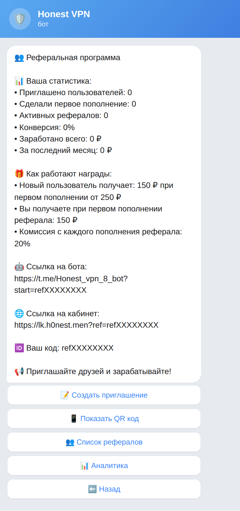
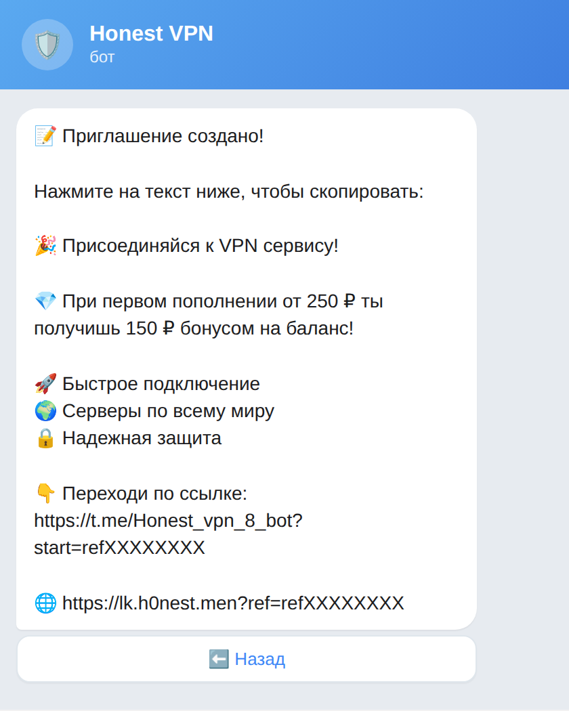
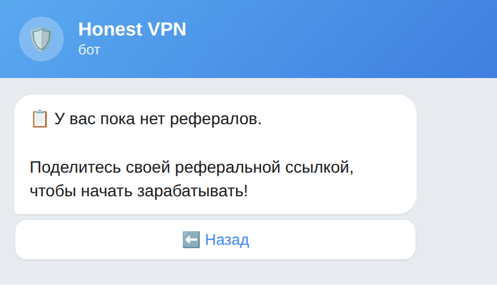
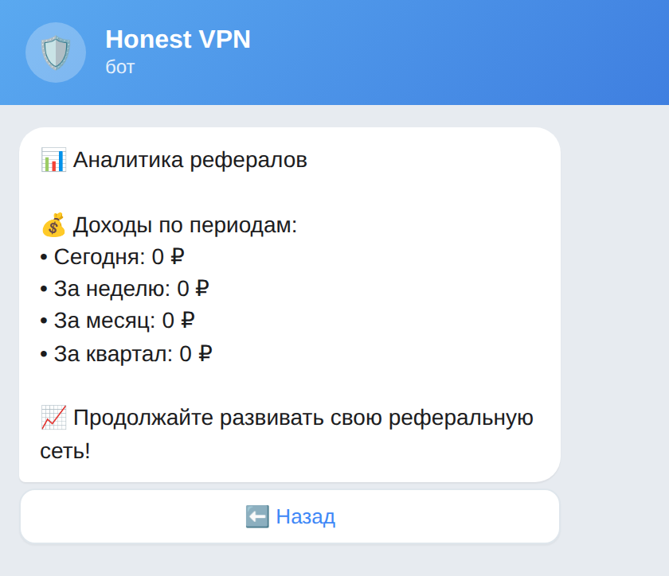
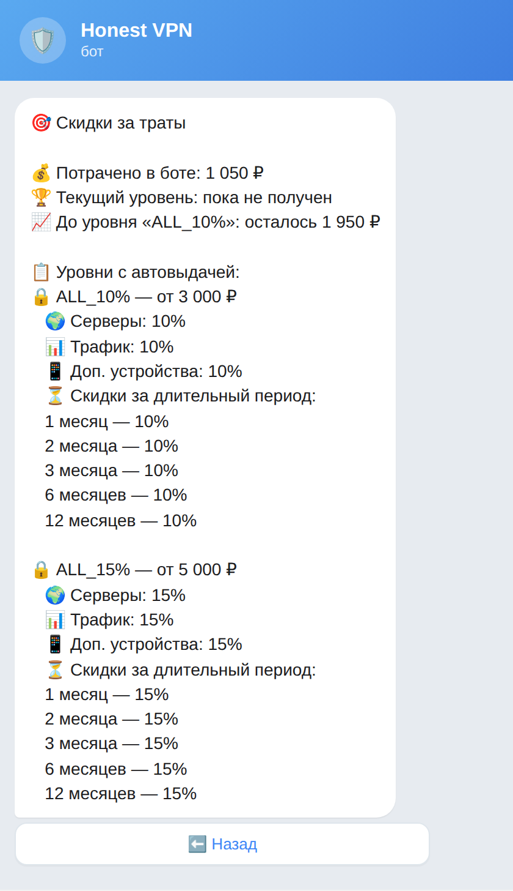
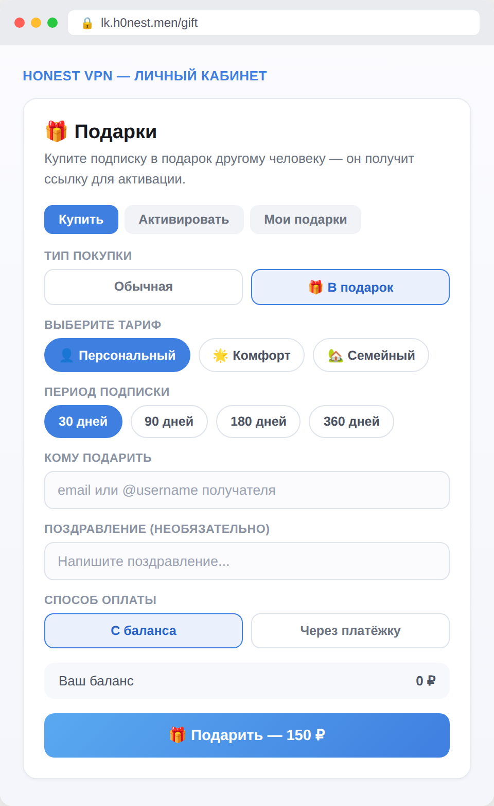
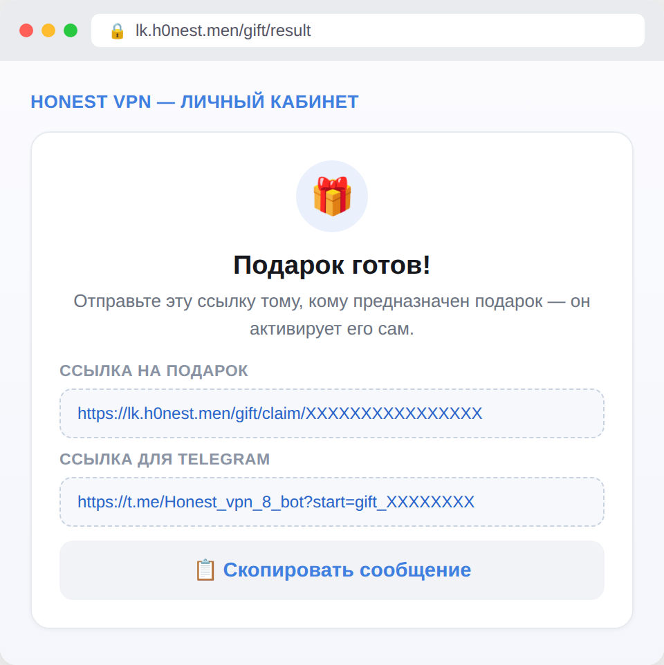
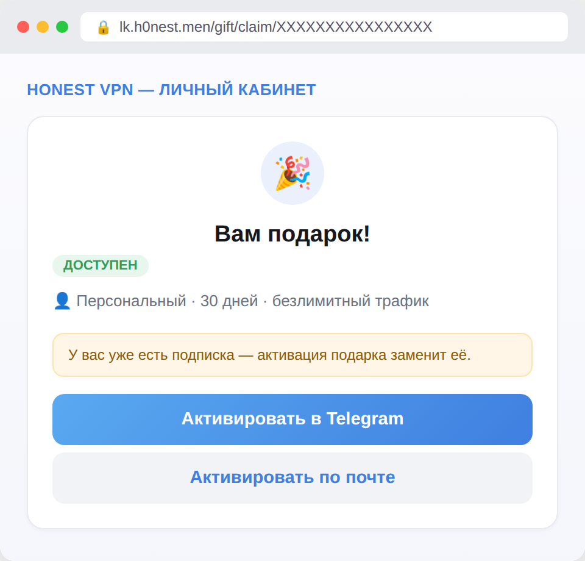

# Honest VPN — инструкция по боту (часть 3: партнёрка, скидки, подарки)

Продолжение инструкции по боту [@Honest_vpn_8_bot](https://t.me/Honest_vpn_8_bot) — [часть 1](https://telegra.ph/Honest-VPN--instrukciya-po-botu-08-08) (покупка и подключение), [часть 2](https://telegra.ph/Honest-VPN--instrukciya-po-botu-chast-2-upravlenie-podpiskoj-08-08) (управление подпиской). Здесь — партнёрская программа, уровни скидок за траты и подарочные подписки на сайте.

## 1. Партнёрская программа — как это работает

Откройте **«🤝 Партнерка»** в главном меню. У каждого пользователя — своя уникальная реферальная ссылка и код.

**Схема бонусов:**

- Друг переходит по вашей ссылке и запускает бота
- Как только друг пополняет баланс в первый раз (от 250 ₽) — он сразу получает 150 ₽ бонусом на свой баланс
- Вы получаете 150 ₽ за это же первое пополнение
- Дальше — 20% с КАЖДОГО пополнения этого реферала уходит вам на баланс, бессрочно, автоматически

**Как приглашать правильно:** просто прислать голую ссылку — не самый убедительный вариант. Кнопка **«📝 Создать приглашение»** формирует готовый рекламный текст с преимуществами сервиса — его удобно переслать в личные сообщения или закинуть в чат:

Обратите внимание — в приглашении сразу **две ссылки**: на бота в Telegram и на сайт-кабинет (lk.h0nest.men). Дайте другу обе. Кабинет особенно пригодится, если у человека, которого вы приглашаете, **сам Telegram недоступен без VPN** (так бывает при жёсткой блокировке) — сайт в таком случае откроется напрямую, без VPN, и человек сможет зарегистрироваться и оплатить, даже не имея на тот момент рабочего Telegram.

«📱 Показать QR код» на практике просто повторно присылает те же две ссылки текстом (без картинки QR) — печатать/показывать с телефона на телефон эти ссылки вручную тоже работает.

«👥 Список рефералов» — кто уже пришёл по вашей ссылке и их статус:

«📊 Аналитика» — сколько вы заработали за сегодня/неделю/месяц/квартал с рефералов:

## 2. Скидки за траты (раздел «Инфо»)

Это накопительная программа лояльности — чем больше вы в сумме потратили в боте за всё время, тем выше автоматическая скидка на будущие покупки. Открывается через «ℹ️ Инфо» → «🎯 Скидки за траты».

Скидка выдаётся **автоматически** по достижении порога и действует сразу на всё: подключение серверов, докупку трафика, докупку устройств и на длинные периоды подписки (1–12 месяцев). Считается общая сумма всех ваших покупок и пополнений за всё время, текущий и следующий уровень видны прямо на этом экране.

## 3. Подарить подписку другому человеку

Эта функция — только на сайте [lk.h0nest.men](https://lk.h0nest.men), в боте её нет. Заходите в личный кабинет и открываете раздел **«🎁 Подарки»**.

Выбираете тариф и срок как при обычной покупке, включаете переключатель **«В подарок»**, и дальше два варианта:

- Указать получателя (email или @username в Telegram) — тогда получатель ещё и увидит уведомление о подарке
- Оставить поле пустым — тогда вы просто получите ссылку/код, который можно переслать вручную куда угодно (хоть в WhatsApp, хоть на бумажке)

Оплатить можно с баланса кабинета или через обычную платёжку — деньги списываются с вашего счёта, получателю ничего платить не нужно.

После оплаты — готовая ссылка на подарок:

Получатель переходит по ссылке и видит вот такой экран — жмёт «Активировать», и подписка подключается на его аккаунт (через Telegram-бота или по email, если Telegram у него не привязан). Если у получателя уже была активная подписка — подарок её заменит, об этом честно предупреждают заранее:

---

**Часть 1:** [покупка и подключение](https://telegra.ph/Honest-VPN--instrukciya-po-botu-08-08) · **Часть 2:** [управление подпиской](https://telegra.ph/Honest-VPN--instrukciya-po-botu-chast-2-upravlenie-podpiskoj-08-08)

